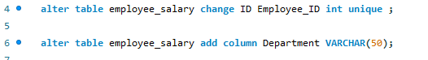
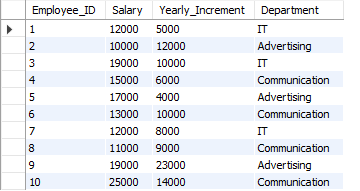
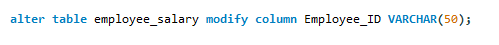
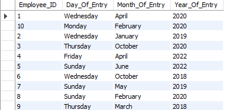
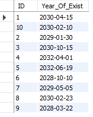

# Updating and Modifying data in MySQL

## Introduction

For this task, the commands used to update and modity data within a table will be of great use. 

## Problem statement

- The first question in this task involved changing the inital table names that is Staff_Info, Staff_Salary to Employee_Info, Employee_Salary respectively.

  

  The command to rename tables in MySQL "ALTER TABLE" 

 - The second question involved renaming the ID columns to Employee_ID and adding another column named "Department" to the Employee_Salary.
 
    

    To rename the ID columns to Employee_ID the syntax "ALTER TABLE table_name CHANGE old_column_name New_column_name data type;"
    To add a new column to the Employee_Salary table, the syntax "ALTER TABLE table_name ADD COLUMN column_name datatype;"

 - The third question in this task looked at updating data within a table,updating multiple rows.

   Here employees with the following Employee_ID were updated to the following department as follow:

 1, 3, 7 - IT
 ---
 2, 5,  9 - Advertising
 ---
 4, 6, 8, 10 - Communication.
 ---

   

 - Changing the datatype  of the Employee_ID to text.

 

The syntax "ALTER TABLE table_name MODIFY COLUMN column_name datatype;

  
- Run a query that returns day, month and year of Date_Of_Entry of the employee.

The commands used here are "SELECT YEAR, MONTHNAME, DAYNAME, SELECT * FROM"

- Run a query that adds 10 years to the date_of_entry and name it Year_of_exit.

  

The commands used were "DATE_ADD, SELECT * FROM"

- Update all the Employee_Info table with all these changes

  

The commands used were "ALTER TABLE, UPDATE"

  

## Conclusion

This task explored how to modify and update data and the date/time function.

  
